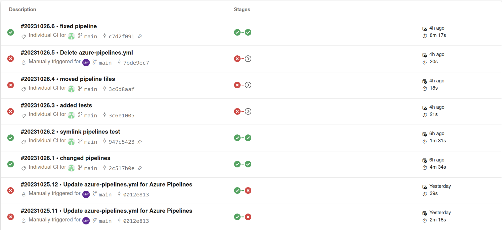

# Lab2

- [Links](#links)
- [Pipeline](#pipeline)

## Links

- [Development Side](https://express823476.azurewebsites.net/)
- [Production Site](https://express823476prod.azurewebsites.net)

## Pipeline

successful and failed deployments:

- [Dev Pipeline](azure-pipelines.yml)
- [Prod Pipeline](azure-pipelines-prod.yml)

## Release Documentation

every time the main branch gets a new commit the pipeline gets triggered. The pipeline will run the tests and build the site. If they pass it gets deployed to the dev site. The commit only gets deployed to the prod site if all tests are passed and it gets approved.