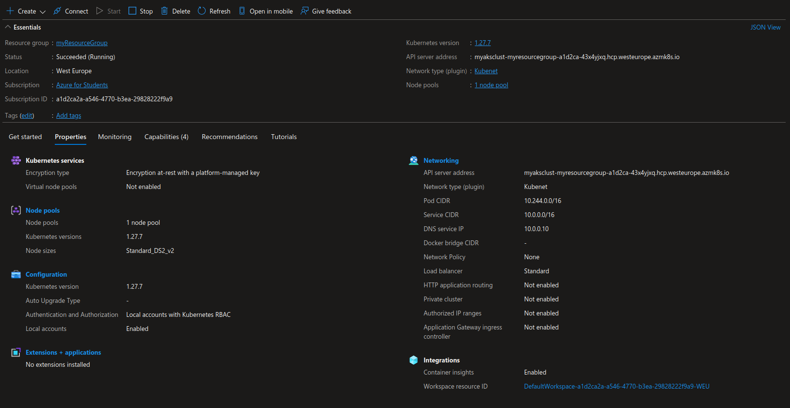

# Aufgabenstellung
- Aufestezen und Konfiguration eines AKS in Azure
- Konfiguration und deplyoment von Wordpress incl. MySQL in dem AKS cluster.

# Instructions

Erstellung von resource group:
```powershell
az group create --name myResourceGroup --location westeurope
```

Erstellung von AKS cluster:
```powershell
az aks create -g myResourceGroup -n myAKSCluster --enable-managed-identity --node-count 2 --enable-addons monitoring --enable-msi-auth-for-monitoring  --generate-ssh-keys
```

Installation von kubectl:
```powershell
az aks install-cli
```

Verbindung zum cluster herstellen:
```powershell
az aks get-credentials --resource-group myResourceGroup --name myAKSCluster
```

Deployment:
```powershell
kubectl apply -f .\azure-wp.yaml
```

# Screenshot



# File description
- azure-wp.yaml: Datei für das deployment von der Datenbank und dem webserver.